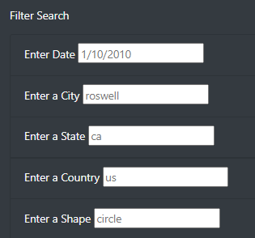
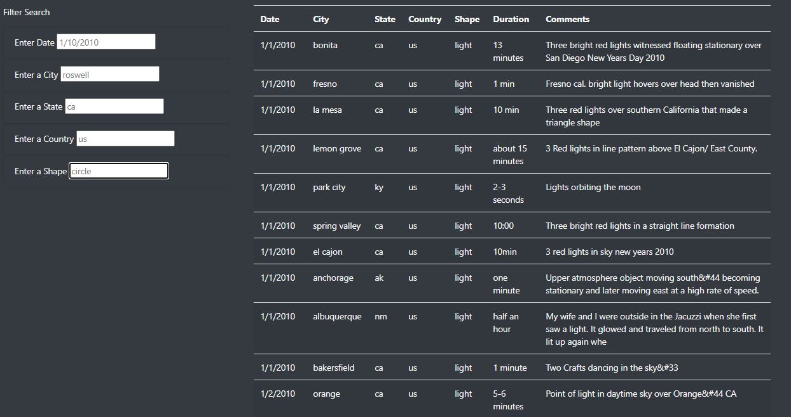
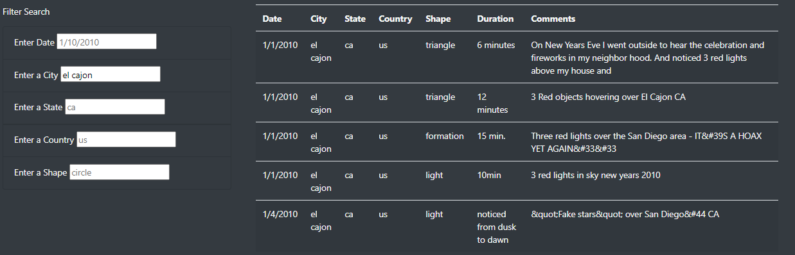
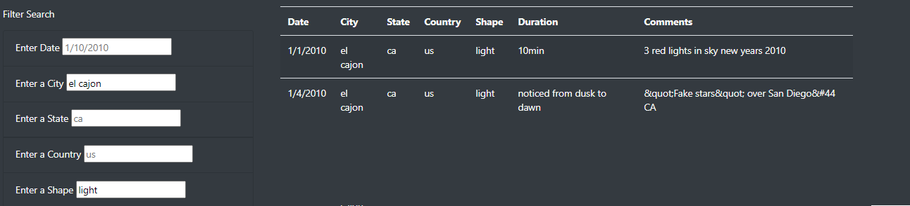

# UFOs: displaying filterable UFO sighting data

## Overview
Data journalist Dana wants to display UFO sighting data for an article she is writing.  Because her dataset is large, she wants to display the data as a filterable table on a website, so readers of her article can look at the subsets of information that are most relevant to their interests.  To achieve this end, I created a website that displays her article and uses javascript to filter the sighting data based on the date, city, state and country of the sighting, as well as the shape of the sighted UFO.

## Results

### Live Link

https://neurobio.github.io/UFOs/

### How to filter
1) Users can filter the data set using the Filter Search section of the webpage (see **Fig 1**).

**Figure 1:** The appearance of the table filters.

2) The user types in an appropriate value into one of the filters and then hits enter, tab, or clicks off of the filter input to trigger the filter.  The filter removes all sightings from the table that do not match the filter criterion.  E.g. if a user wants to filter for sights in el cajon, the table will go from the entire data set (see **Fig 2**) to just those with el cajon as the city of sighting (see **Fig 3**).

**Figure 2:** The appearance of the table before it has been filtered.

**Figure 3:** The appearance of the table after it has been filtered for city = el cajon.

3) Filters can stack, so filtered results can be further refined (see **Fig 4**).

**Figure 4:** The appearance of the table before has been filtered for city = el cajon and shape = light.

4) Filters can be removed by deleting any text in the filter inputs.

## Summary
### Drawbacks
- One drawback of the current website design is that uses cannot filter the data based on the duration of the sighting.  The duration data is messy and would require transformation into a standardized format for this to be possible.  Even if it were transformed, ideally a duration filter would not search for exact values for duration, but rather take a range of values.  This would likely require too much work to implement given the limited additional value this filter would add.
- The filters are currently case sensitive, so a user may accidently exclude desired data if capitol letters are used. 
### Further Development
- To further develop the website, there is a great deal of additional information included in the comment about a sighting.  Adding a filter that checks whether a word or pattern is present in a comment would allow users to search for more obscure details about the sightings, such as the color of the UFO, when it was seen (e.g. day, night), or its behavior (e.g. flickering, hovering).
- The current filters only allow for inclusion, not exclusion.  Allowing users to utilize an advanced search keyword such as NOT would give users the power to exclude unwanted results (e.g. as much of the dataset is sightings from the US, perhaps a user would want to exclude all US data to see what other countries have UFO sightings).
